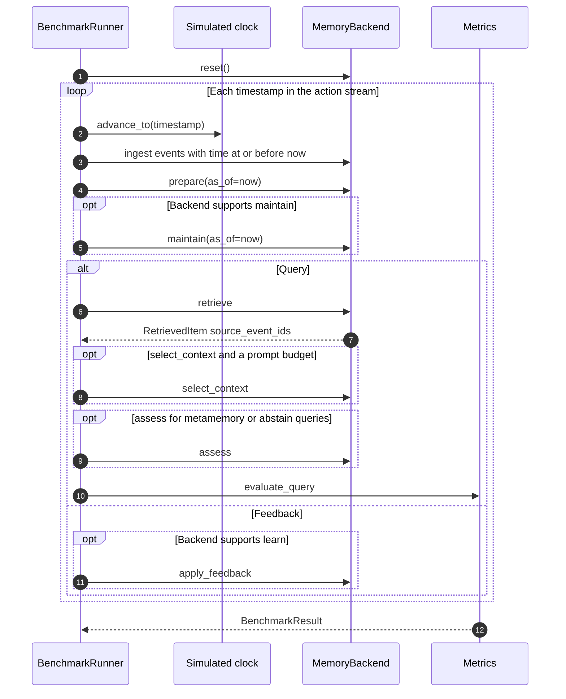
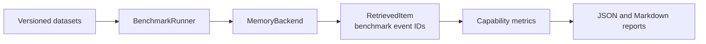
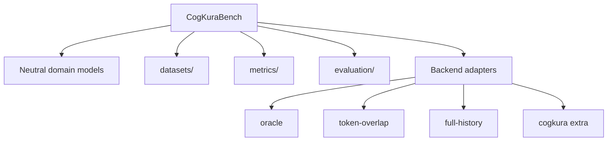

# CogKuraBench

CogKuraBench is a deterministic benchmark for long-term AI memory systems. It replays a versioned project history against a memory backend, asks queries at simulated times, and scores whether the backend retrieved the right evidence, updated after changes, forgot stale facts, and selected a usable working-memory context.

The current release is 0.1.1. Layer A scoring does not use an LLM, and a deterministic run does not call external APIs.

This repository owns datasets, ground truth, the backend contract, execution, metrics, and reports. It does not own CogKura's algorithms or any other memory implementation.

## What it measures

Each query is tagged with a capability. Results are reported per capability. There is no combined benchmark score.

| Capability | What the score reflects |
| --- | --- |
| Direct, episodic, and associative recall | Whether expected event IDs appear in the ranked retrieval list |
| Temporal recall | Current-state accuracy versus historical-state accuracy |
| Knowledge update | Whether replacement evidence is retrieved and stale IDs stay out |
| Forgetting | Suppression of obsolete or noisy evidence without dropping relevant long-term items |
| Working memory | Whether expected evidence fits the query's token budget |
| Learning | Change in retrieval after explicit feedback |
| Metamemory | Detection of missing knowledge and conflicts |

Expected evidence is always a benchmark event ID, never a backend-internal key.

## Requirements

- Python 3.11 or later
- [uv](https://docs.astral.sh/uv/)

## Install

Clone the repository, then install the locked dev environment:

```bash
uv sync --dev --locked
```

That is enough for `oracle`, `token-overlap`, and `full-history`.

To evaluate CogKura as well:

```bash
uv sync --extra cogkura --dev --locked
```

The CogKura extra pins `cogkura>=0.14.4,<0.15.0`.

## First run

Start with the mini golden dataset and the oracle backend. Oracle returns the declared expected evidence, so it checks the harness rather than ranking a memory system.

```bash
uv run cogkura-bench datasets
uv run cogkura-bench validate-dataset mini
uv run cogkura-bench run --dataset mini --backend oracle
```

A successful run prints each capability's primary metric and writes:

- `results/mini/oracle/<timestamp>.json`
- `results/mini/oracle/<timestamp>.summary.md`

Then run a real retrieval baseline on the same dataset:

```bash
uv run cogkura-bench run --dataset mini --backend token-overlap
```

If you installed the CogKura extra:

```bash
uv run cogkura-bench run --dataset mini --backend cogkura
uv run cogkura-bench compare cogkura token-overlap --dataset mini
uv run cogkura-bench inspect direct-001 --backend cogkura --dataset mini
```

`demo` narrates a subset of story queries. It defaults to `software_project_v1` and the `cogkura` backend.

```bash
uv run cogkura-bench demo --backend token-overlap
uv run cogkura-bench demo --dataset helios_v1 --backend cogkura
```

Atlas and Helios commands live in [docs/scenarios.md](docs/scenarios.md).

## How a run works

The runner walks a compiled action stream on a simulated clock. Events later than the current time are not ingested, so a query cannot see the future.



Scoring compares those benchmark event IDs to the query's expected, acceptable, and forbidden lists. Adapter metadata is observational only.

## Architecture

CogKuraBench is a consumer of memory systems. Adapters implement `MemoryBackend` and must map retrieved memories back to benchmark event IDs.





Useful starting points in the tree:

- `datasets/` versioned scenario files (`manifest.json`, `events.jsonl`, `queries.jsonl`, `feedback.jsonl`)
- `src/cogkurabench/models.py` frozen domain models
- `src/cogkurabench/runner.py` clock, ingest, query, and feedback
- `src/cogkurabench/backends/` adapters and the `MemoryBackend` protocol
- `src/cogkurabench/metrics/` scoring
- `src/cogkurabench/evaluation/` aggregation and reports

More detail is in [docs/architecture.md](docs/architecture.md).

## Datasets

`--dataset` takes the directory name under `datasets/`. Result folders use the manifest `name`, so Atlas writes to `results/software-project-v1/` and Helios to `results/helios-v1/`.

| CLI name | Events | Queries | Feedback | Role |
| --- | ---: | ---: | ---: | --- |
| `mini` | 15 | 12 | 2 | Golden fixture for harness correctness |
| `software_project_v1` | 61 | 24 | 3 | Project Atlas, about 60 simulated days |
| `helios_v1` | 550 | 49 | 3 | Project Helios, about 180 simulated days, paraphrase and interference |

Queries tagged `core` appear as a second table in `compare` output and summary Markdown.

## Backends

| Backend | Purpose |
| --- | --- |
| `oracle` | Returns declared expected evidence. Validation infrastructure, not a competitor. |
| `token-overlap` | Shallow deterministic lexical baseline |
| `full-history` | All currently visible events, in chronological order |
| `cogkura` | Optional CogKura 0.14.x adapter |

Unsupported optional capabilities return `None`. Backends must not fake features they do not provide.

To plug in another memory system, implement `MemoryBackend` in `src/cogkurabench/backends/base.py` and register it in `src/cogkurabench/backends/registry.py`. Adapter notes are in [docs/backends.md](docs/backends.md).

## Commands

| Command | What it does |
| --- | --- |
| `cogkura-bench datasets` | List dataset directory names |
| `cogkura-bench validate-dataset <name>` | Load and check a dataset |
| `cogkura-bench run --dataset <name> --backend <backend>` | Score one backend and write `results/` |
| `cogkura-bench compare <backends...> --dataset <name>` | Run several backends and print capability tables |
| `cogkura-bench inspect <query-id> --backend <backend> --dataset <name>` | Replay the dataset and print one query |
| `cogkura-bench demo --dataset <name> --backend <backend>` | Narrated walkthrough of story queries |

`run` writes results unless you pass `--no-write`. `--quiet` hides the capability summary. `inspect` replays the full dataset so the simulated clock and ingest order stay honest.

## Reading results

`run` prints each capability's primary metric. The Markdown summary also includes a core-query table when tags are present. Temporal recall reports `temporal_historical_accuracy` as a secondary column.

Use `inspect` when a query looks wrong. It shows gold IDs, structured cues, retrieved items, and per-item diagnostics. Scoring still uses flattened benchmark event IDs, not adapter metadata.

Abstain queries (`should_abstain`) are excluded from retrieval averages such as Recall@K and MRR, but they still contribute to metamemory counts.

Metamemory scores from CogKuraBench 0.1.0 are not comparable to 0.1.1 without a corrected baseline. Metric definitions are in [docs/metrics.md](docs/metrics.md).

## Documentation

- [`docs/architecture.md`](docs/architecture.md)
- [`docs/benchmark.md`](docs/benchmark.md)
- [`docs/metrics.md`](docs/metrics.md)
- [`docs/scenarios.md`](docs/scenarios.md)
- [`docs/backends.md`](docs/backends.md)
- [`docs/roadmap.md`](docs/roadmap.md)

## License

Apache 2.0. See [LICENSE](LICENSE).
