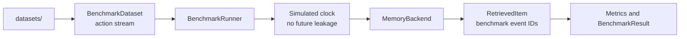
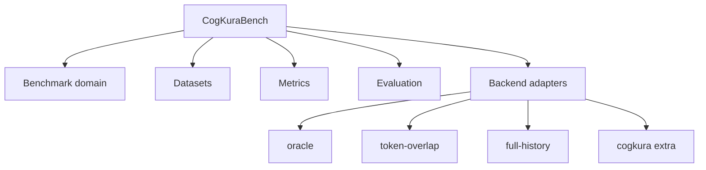

# Architecture

CogKuraBench separates benchmark domain models, backend adapters, metrics, and evaluation. New-user install and first-run steps are in the [README](../README.md).

Dependency direction:

CogKuraBench is a consumer of memory systems, not part of CogKura.
