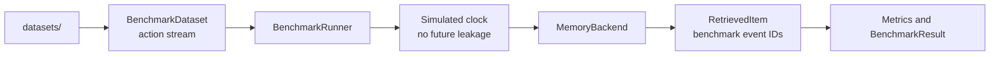
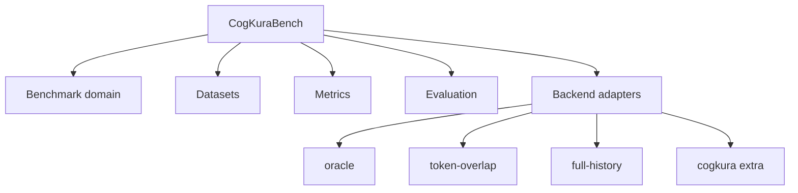
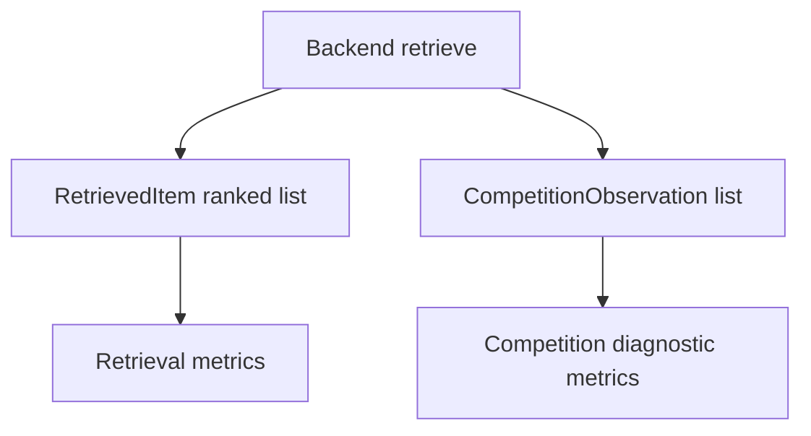

# Architecture

CogKuraBench separates benchmark domain models, backend adapters, metrics, and evaluation. New-user install and first-run steps are in the [README](../README.md).

Dependency direction:

CogKuraBench is a consumer of memory systems, not part of CogKura.

## Evidence groups (0.3.0)

Queries may carry `expected_evidence_groups` and `forbidden_evidence_groups` alongside flat evidence ID lists. Metrics in `metrics/evidence_groups.py` classify each expected group into retrieval vs bounded-context stages. This is separate from grouped retrieval scoring in `metrics/ranking.py` (0.2.0), which scores ranked `RetrievedItem` positions.

The runner calls `retrieve()` then `select_context()` when `prompt_budget_tokens` is set. Broad recall diagnostics use the retrieval response; budget diagnostics use the context response when the backend supports selection.

## Competition diagnostics (0.3.4)

Retrieval scoring uses `RetrievedItem` ranks only. Competition observations are optional on `RetrievalResponse` and scored separately when `BackendCapabilities.competition_diagnostics` is true. CogKura maps `inspect_recall` competition evidence to benchmark event provenance; raw Core counters remain in `backend_metadata`.
