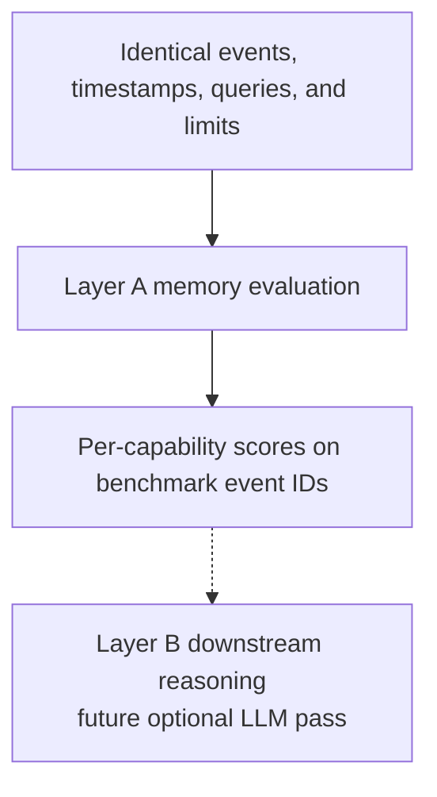

# Benchmark methodology

CogKuraBench evaluates memory systems in two layers:

## Layer A — memory evaluation (0.2.0)

No LLM required. Measures evidence retrieval, ranking, temporal correctness, updates, forgetting, working-memory selection, learning, metamemory, and competition diagnostics where supported. Primary top-K metrics count ranked `RetrievedItem` groups. Competition diagnostics (0.3.4) measure whether related memories are identified without false competitors; they do not score retrieval suppression.

## Layer B — downstream reasoning (future)

Optional LLM evaluation using identical retrieved context across backends.

## Principles

- All backends receive identical events, timestamps, queries, and limits.
- Ground truth is checked into the repository and versioned.
- Expected evidence refers to benchmark event IDs, not backend-internal IDs.
- No single benchmark score: capability scores are reported separately.
